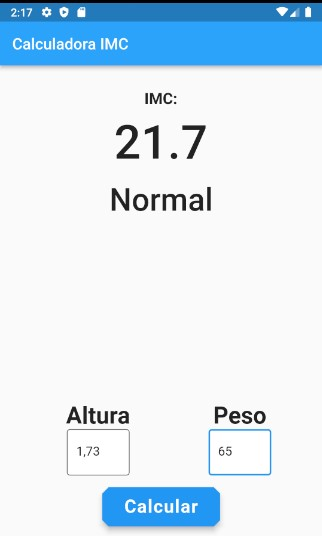

# Calculadora IMC em flutter

Um projeto de iniciante para prática de flutter.

## Utilização

Insira altura e peso e toque em calcular para descobrir seu índice de massa corporal e sua classificação.

### Exemplos

